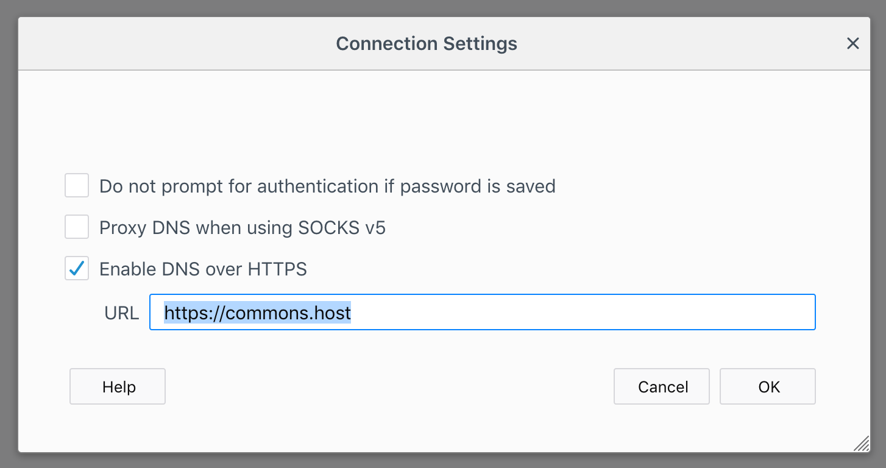
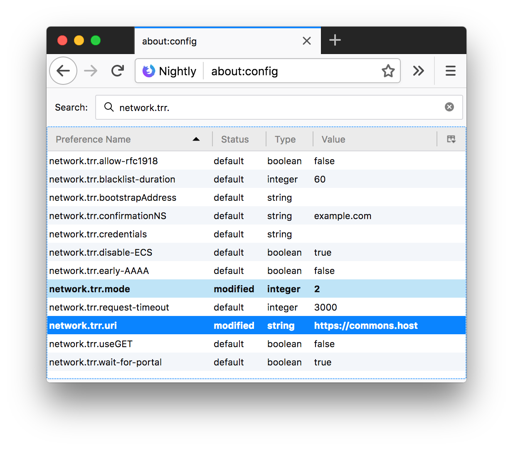

# playdoh 🛢

[](https://travis-ci.org/qoelet/playdoh)
[](https://badge.fury.io/js/playdoh)

Middleware for Node.js web servers to expose DNS over HTTPS (DoH).

Implement: [*DNS Queries over HTTPS (DoH)* [RFC8484]](https://tools.ietf.org/rfc/rfc8484.txt).

## Demo: Try it with Firefox

Configure Firefox to use Commons Host DNS over HTTPS in 3 steps. Enjoy a more private and secure Internet.

Playdoh powers the 🐑 [Commons Host](https://commons.host) DNS over HTTPS service running on >20 global edge servers. The service is free and public. No tampering, no filtering, no logging.

### Using Firefox 64+

1. Open **Preferences** and under **Network Settings** press the **Settings...** button.

1. Check **Enable DNS over HTTPS**

1. Enter in the **URL** field: `https://commons.host`



### Using Firefox 62

1. Browse to: `about:config`
1. Search: `network.trr.`
1. Configure:

   | Preference Name | Value |
   |-|-|
   | `network.trr.mode` | 2 |
   | `network.trr.uri` | https://commons.host |



## Usage

Note: HTTP/2 is the minimum *recommended* version of HTTP for use with DoH.

```js
const { playdoh } = require('playdoh')

// Defaults
const options = {
  // udp4 (IPv4) or udp6 (IPv6)
  protocol: 'udp4',

  // Defaults to 0.0.0.0 (udp4) or ::0 (udp6)
  localAddress: '',

  // Defaults to 127.0.0.1 (udp4) or ::1 (udp6)
  resolverAddress: '',

  // Standard DNS port
  resolverPort: 53,

  // Maximum DNS lookup duration
  timeout: 10000
}

const middleware = playdoh(options)
```

## Returns: `middleware(request, response, next)`

The middleware function follows the Node.js convention and is compatible with most popular web server frameworks.

## Options

### `protocol`

Default: `udp4`

Can be either `udp4` or `udp6` to indicate whether to connect to the resolver over IPv4 or IPv6 respectively.

### `localAddress`

Default: `0.0.0.0` (IPv4) or `::0` (IPv6)

The UDP socket is bound to this address.

Use a loopback IP address (`''` empty string, `localhost`, `127.0.0.1`, or `::1`) to only accept local DNS resolver responses.

Use a wildcard IP address (`0.0.0.0` or `::0`) to accept remote DNS resolver responses.

### `resolverAddress`

Default: `127.0.0.1` (IPv4) or `::1` (IPv6)

The IP address of the DNS resolver. Queries are sent via UDP.

See also: [List of public DNS service operators](https://en.wikipedia.org/wiki/Public_recursive_name_server) on Wikipedia.

### `resolverPort`

Default: `53`

The port of the DNS resolver.

### `timeout`

Default: `10000`

Number of milliseconds to wait for a response from the DNS resolver.

### Connect

```js
const connect = require('connect')
const { createSecureServer } = require('http2')
const app = connect()
app.use(middleware)
const options = {
  key: fs.readFileSync('server-key.pem'),
  cert: fs.readFileSync('server-cert.pem')
}
const server = createSecureServer(options, app)
server.listen(443)
```

### Fastify

```js
const fastify = require('fastify')({
  http2: true,
  https: {
    key: fs.readFileSync('server-key.pem'),
    cert: fs.readFileSync('server-cert.pem')
  }
})
fastify.use(middleware)
fastify.listen(443)
```

## References

- https://dnsprivacy.org/wiki/display/DP/DNS+Privacy+Clients#DNSPrivacyClients-DOH

- https://github.com/curl/curl/wiki/DNS-over-HTTPS

## Credits

Made by [Kenny Shen](https://www.machinesung.com) and [Sebastiaan Deckers](https://twitter.com/sebdeckers) for 🐑 [Commons Host](https://commons.host).
